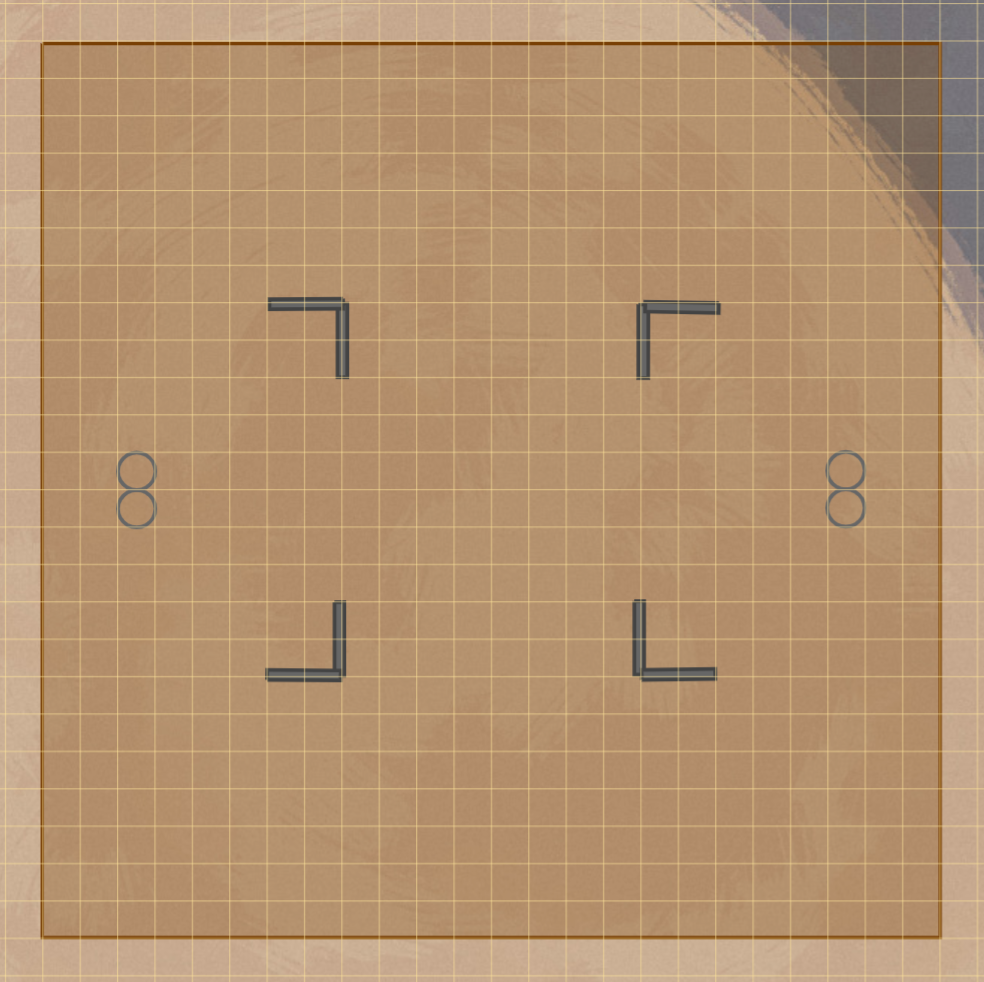

# 5E Class Draft - Rules v1.1

5E Class Draft is a PvP format featuring on-the-fly character creation followed by an arena combat encounter.

## Overview

This game mode is designed for two players, each piloting two characters. The game has 3 stages:

1) Draft - Players take turns selecting classes for character creation.

2) Character Creation - Each player creates two characters using only the classes they drafted.

3) Combat - Best two out of three; short rest after the first round, long rest after the second round.

This document is presented in the order of these 3 stages. However, in order to make informed decisions during the draft, players should be made aware of the rules for Character Creation and Combat before starting the Draft.

## Phase I: Draft (3mins)

A pool of class options is offered to both players. By default, all 12 core classes (PHB classes + Artificer) are available.

Players secretly and simultaneously pick two classes at a time. After each round of picks, the GM reveals each player's selections. If both players selected the same class, that class is banned - no one obtains it. Otherwise players obtain their picks. All selected or banned classes are then removed from the pool. This process repeats until each player has obtained 4 classes or no more options remain in the pool.

If each player has 3 classes, subsequent rounds of drafting will involve picking only one class each.

In the event that 4 or fewer class options remain in the pool, no more bans will occur. Should both players select the same class again, both players obtain that class.

## Phase II: Character Creation (40mins)

Players each create two characters using the following rules.
- **Level**: 4
- **Attributes**: Point buy
- **HP**: Average
- **Unearthed Arcana**: No
- **Races**: Any official option.
- **Classes**:
  - **Subclasses**: Any official option.
  - Use only the classes you have obtained during the draft.
  - **You cannot use the same class on both characters**.
  - **Multiclassing is allowed**.
- **Background**: None. Characters are limited to their class skills only.
- **Equipment**: Characters have 0gp. Mundane equipment with a price less than 100gp per item is free.

### Playtesting Rules

The following additional rules are in place *temporarily* for playtesting purposes only:
- No Wildemount.
- **No feats. No racial options which allow feats.**

## Phase III: Combat (1-2hrs)

### Piloting Two Characters

**Each player takes all their characters' turns simultaneously.** They may freely interweave their characters' movements, actions, etc.

> *Example*: Character A moves into a flanking position. Character B attacks with advantage. After the attack, Character A repositions.

### Match Structure

Combat is fought in a series of matches, best two out of three.

#### Initiative: Who Goes First?

Initiative in the first match is determined by the sum of the team's initiative modifiers. **Initiative is not rolled.** Effects which would grant advantage on initiative rolls instead add a character's proficiency bonus to their initiative modifier. In case of a tie, flip a coin.

For each subsequent match, the player who lost the previous match goes first.

> *FAQ*: Can you choose to go second?
>
> *Answer*: Just pass your first turn!

#### Resurrection and Resting Between Matches
At the end of each match, dead characters are resurrected with 1HP and unconscious characters are restored to 1 HP and awoken.

There is a short rest after the first round and a long rest after the second round.

#### Casting Spells Between Matches

Each character may cast up to one spell before each match. Spell material component costs are ignored so long as the caster has a focus.

#### Conceding a Match

A player may concede a match at any time, even during another player's turn. If a player concedes after an attack roll but before the damage roll, the damage will still be dealt before the match ends.

### The Arena

The venue is a small arena with a 120ft x 120ft square fighting ring in the middle. Teams start at opposite sides 10ft from the edge with a 90ft gap between them. A small number of walls providing full cover are placed symmetrically.

  
<b>Click here to see the arena map.</b>

  

### Public Information

The full text of Spells, Actions, Features, and other core game rules, including the full rules text of what they do, are public information. Everyone can freely access this information.

Additionally, *once the first match has started*, each character's races, subraces, classes, subclasses, and equipment become public information.

#### Caveat: Readied Actions

Readied actions may be privately communicated to the GM. That an action has been readied will still be communicated publicly, but the specific action and the trigger condition will be private until the trigger is met and the action is executed.

### Additional Combat Rules

#### Leaving the Ring and Flying

**Leaving the ring counts as an elimination.** Flying is permitted, but **willingly ending a turn mid-flight, even above the ring, counts as an elimination**.

#### Spell Material Components

Spell material component costs are ignored so long as the caster has a focus.

#### Flanking

Flanking grants advantage on attack rolls. If two characters are on opposite sides or opposite corners of an enemy, they each have advantage on attacks against that enemy.

#### Additional Action Options

The additional Action Options detailed in the DMG pg.271 (such as Disarm) may be used.
